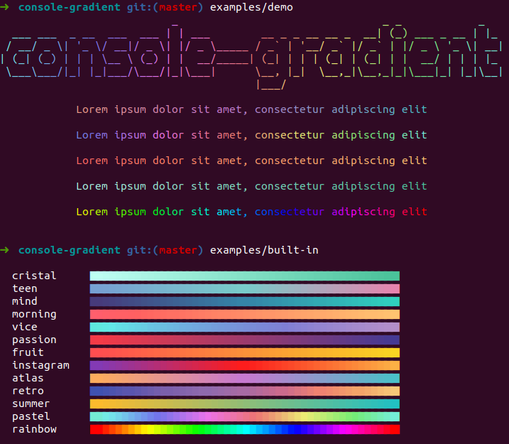

# Console Gradient
Helper to handle gradient text with Symfony Console inspired by [new features](https://symfony.com/blog/new-in-symfony-5-2-true-colors-in-the-console), [gradient-string](https://github.com/bokub/gradient-string), [tinygradient](https://github.com/mistic100/tinygradient) and [TinyColor](https://github.com/bgrins/TinyColor).



## Try examples

```bash
$ git clone git@github.com:chr-hertel/console-gradient.git
$ cd console-gradient
$ composer install
$ example/demo
$ example/built-in
```

## Usage

```bash
$ composer require stoffel/console-gradient
```

Usage in PHP

```php
use Stoffel\Console\Gradient\GradientHelper;

GradientHelper::create($output)
    ->setText('Hello World!')
    ->setColors(['#FF0000', '#00FF00', '#0000FF'])
    ->write();
```
